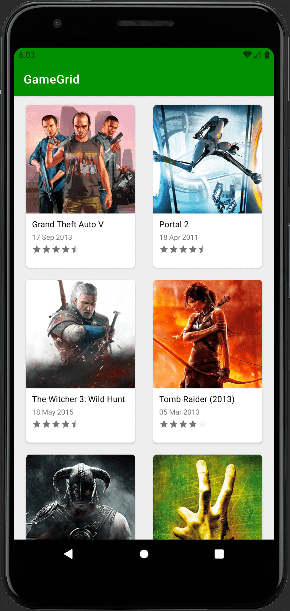
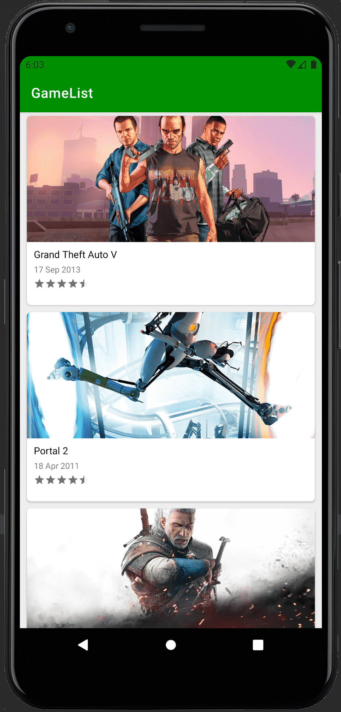

# GameListingApp

This is an sample Game Listing application using Product Flavor, which is supposed to display games using the 
RapidApi/accujazz/api/rawg-video-games-database API.

This repository shows you how to use Retrofit library using RxJava in android. It uses MVVM pattern and Product Flavor.

Support libraries:Retrofit2, View Binding, RxJava, Glide, Constraintlayout, RecyclerView, CardView, Product Flavor.

Adding multiple build variants in android

    productFlavors {

        GameList {
            applicationId "com.enderyasli.gameListingApp.gamelist"
            resValue "string", "app_name", "GameList"

        }

        GameGrid {
            applicationId "com.enderyasli.gameListingApp.gamegrid"
            resValue "string", "app_name", "GameGrid"

        }

    }

Use of Product Flavor;

Adapter, Model, ViewModel, Service were added to the main module to be used in all packages,
and GridSpacingItemDecoration and Measure classes to the GameGrid module for the Grid view.

The screen of the application is as follows.

